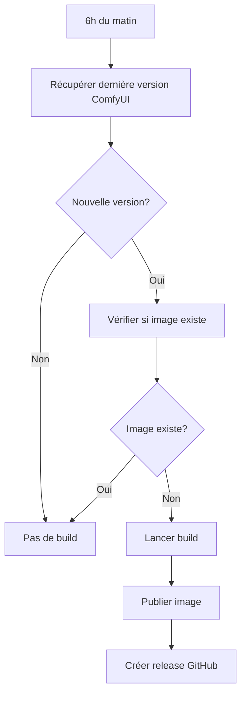

# 🚀 Système de Build Automatique ComfyUI

Ce repository utilise un système de build automatique intelligent qui détecte automatiquement les nouvelles versions de ComfyUI et build une nouvelle image Docker seulement quand c'est nécessaire.

## 📅 Planification

- **⏰ Tous les jours à 6h du matin** (heure de Paris)
- **🔍 Vérification automatique** des nouvelles versions ComfyUI
- **🚫 Build conditionnel** : seulement si nécessaire

## 🏷️ Convention de Nommage

Les images Docker sont tagguées avec le format :
```
{VERSION_CONTENEUR}-comfyui-{VERSION_COMFYUI}
```

**Exemples :**
- `0.1.0-comfyui-v0.3.51` - Version conteneur 0.1.0 avec ComfyUI v0.3.51
- `0.1.1-comfyui-v0.3.52` - Version conteneur 0.1.1 avec ComfyUI v0.3.52

## 🔄 Processus de Build

### 1. Détection automatique


### 2. Build intelligent
- ✅ **Build si** : Nouvelle version ComfyUI détectée
- ✅ **Build si** : Image manquante pour version existante  
- ✅ **Build si** : Déclenché manuellement avec force
- ❌ **Pas de build si** : Tout est à jour

## 🛠️ Build Manuel

### Via GitHub Actions
1. Aller dans **Actions** → **ComfyUI Auto Build**
2. Cliquer **Run workflow**
3. Optionnel : Cocher "Force build"

### Localement
```bash
# Build avec dernière version ComfyUI
./build.sh

# Build avec version spécifique
COMFYUI_VERSION=v0.3.50 ./build.sh

# Test local de détection de version
./test-version-check.sh
```

## 📋 Tags Créés

Pour chaque build réussi :
```bash
# Tags principaux
username/runpod-comfyui:latest
username/runpod-comfyui:0.1.0-comfyui-v0.3.51

# Tag de date
username/runpod-comfyui:v2025.08.22
```

## 🔧 Configuration

### Secrets GitHub requis :
- `DOCKERHUB_USERNAME` - Nom d'utilisateur Docker Hub
- `DOCKERHUB_TOKEN` - Token d'accès Docker Hub

### Variables d'environnement (optionnelles) :
- `DOCKER_REGISTRY` - Registry personnalisé
- `COMFYUI_VERSION` - Version ComfyUI spécifique

## 📊 Monitoring

### Logs GitHub Actions
- ✅ Version ComfyUI détectée
- ✅ Vérification existence image
- ✅ Décision de build
- ✅ Résultat du build

### Notifications
```bash
# Build réussi
✅ Build réussi pour ComfyUI v0.3.52
🐳 Image: username/runpod-comfyui:0.1.0-comfyui-v0.3.52

# Pas de build nécessaire
ℹ️ Aucun build nécessaire - ComfyUI v0.3.51 déjà à jour
```

## 🚀 Avantages

- **⚡ Automatique** : Pas d'intervention manuelle
- **💾 Économe** : Build seulement si nécessaire
- **🔄 À jour** : Toujours la dernière version ComfyUI
- **📋 Traceable** : Versioning clair et releases GitHub
- **⚙️ Optimisé** : Cache Docker pour builds rapides

## 🔍 Debugging

### Vérifier la logique localement
```bash
./test-version-check.sh
```

### Forcer un build
```bash
# Via GitHub Actions
# → Actions → ComfyUI Auto Build → Run workflow → ✅ Force build

# Localement
./build.sh --test
```

### Vérifier une image
```bash
# Vérifier si image existe
docker manifest inspect username/runpod-comfyui:TAG

# Lister toutes les images
docker images username/runpod-comfyui
```

---
